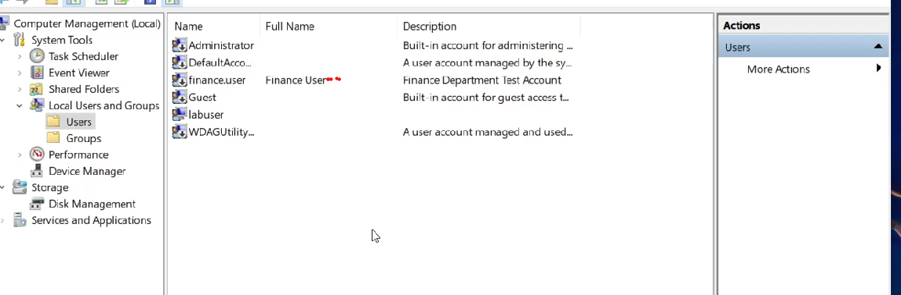
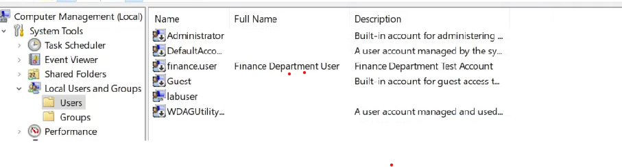

# 🖥️ IT Support Ticket 010 – Rename a Local Windows User Account

---

## 📋 Ticket Information

| Item | Details |
|------|---------|
| **Ticket ID** | ITSUP-010 |
| **Category** | Windows Administration |
| **Difficulty** | Beginner |
| **Estimated Time** | 5–10 Minutes |
| **Operating System** | Windows 10 |
| **Tool Used** | Computer Management |

---

# 📌 Objective

This lab demonstrates how to rename the **Full Name** of a local Windows user account using **Computer Management**.

The objective is to update user account information while keeping the username unchanged.

---

# 🎯 Overview

In this lab, I demonstrated how to:

- Locate a local Windows user account
- Open the account properties
- Update the user's Full Name
- Verify that the changes were successfully applied

Updating user account information is a common Windows administration task performed by IT Support Technicians to maintain accurate user records.

---

# 🛠️ Environment

- Windows 10
- Computer Management
- Local Users and Groups
- Local User Accounts

---

# 💼 Skills Demonstrated

- Windows Administration
- Local User Management
- User Account Administration
- User Profile Management
- Computer Management
- Windows Troubleshooting
- Help Desk Support
- Technical Documentation

---

# 📝 Procedure

## Step 1 — Locate the User Account

The **finance.user** account was located before making any changes.

### Screenshot

---

## Step 2 — Rename the User Account

The account properties were opened, and the **Full Name** was updated from **Finance User** to **Finance Department User**.

### Screenshot

---

# ✅ Result

The local Windows user account information was successfully updated.

The username remained unchanged, while the Full Name was modified to reflect the new user information.

---

# 🎓 Key Learning Outcomes

This lab provided hands-on experience with:

- Updating local Windows user information
- Managing user account properties
- Windows administration
- Help Desk administration
- Technical documentation

---

# 🎥 Video Demonstration

**YouTube Walkthrough:**

https://youtu.be/I572hpStF9w

---

# 📚 Technologies Used

- Windows 10
- Computer Management
- Local Users and Groups
- GitHub
- OBS Studio
- Clipchamp

---

## ⭐ Portfolio Series

This repository is part of my hands-on **Windows IT Support Lab Series**, where I document practical Windows administration tasks performed in realistic IT support scenarios.

I am building a portfolio demonstrating practical skills in **IT Support, Windows Administration, Networking, and Cybersecurity**.
